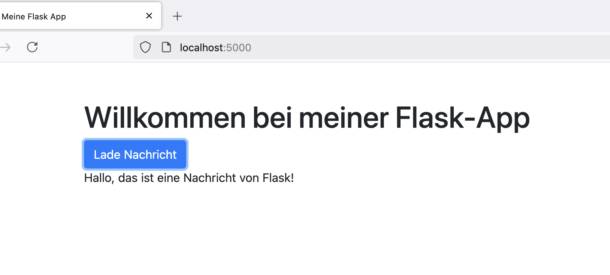

## Woche 2: Python Refresh

Dies ist eine kleine Flask-App mit HTML-Frontend und Azure-Deployment.


- Python & Flask
- HTML, Bootstrap, JavaScript
- Azure WebApp Deployment

```bash
git clone https://github.com/abelasdf/mein-flask-projekt.git
cd mein-flask-projekt
python -m venv venv
pip install -r requirements.txt
python app.py





[Meine Flask App auf Azure](https://mein-flask-app.azurewebsites.net)

**Erfahrungen & Fazit**
- Ich habe gelernt, wie man eine Flask-App erstellt und in Azure deployt.
- Die größten Herausforderungen die vorbereitung und installation der Dependencies. 
```

### Woche 3: Container & Cloud Refresh


Diese Woche wurde die Flask-App in einem Docker-Container ausgeführt und verwaltet.

- Docker & Container
- Flask in Docker integrieren
- Docker Image erstellen & Container starten

```bash
git clone https://github.com/abelasdf/mein-flask-projekt.git
cd mein-flask-projekt
docker build -t mein-flask-app .
docker run -p 5000:5000 mein-flask-app
```


**Erfahrungen & Fazit**
- Ich habe gelernt, wie man eine Flask-App in einem Docker-Container ausführt.
- Die größte Herausforderung war die Behebung von Port-Fehlern und das Neustarten des Docker-Daemons.
- Docker erleichtert das Deployment und sorgt für eine konsistente Umgebung.


## Lernjournal Woche 4 – MDM04 Scraping & Modellierung
**Name:** Abel  
**GitHub:** [abelasdf](https://github.com/abelasdf)  
**Modul:** MDM04 – Daten erheben & aufbereiten  

## Thema der Woche
Diese Woche habe ich mich intensiv mit dem Importieren und Verarbeiten von GPX-Daten in eine MongoDB-Datenbank beschäftigt. Der Fokus lag auf der Datenmigration in die Cloud (CosmosDB), der Analyse in Python sowie dem Trainieren eines einfachen Machine Learning Modells zur Schätzung der Schwierigkeit von Wanderrouten.

---

## Gelernt

### Datenimport & MongoDB
- Verbindung zu einer Azure CosmosDB (MongoDB-kompatibel) hergestellt
- Probleme mit Pfaden und Zugriffen behoben (`FileNotFoundError`, `TypeError`)
- GPX-Dateien korrekt strukturiert und in die Datenbank importiert (`insert_many`)
- Datenbank via `mongosh` überprüft (`use`, `show collections`, `countDocuments()`)

### Modelltraining
- Korrelationen zwischen Höhenmetern, Distanz, Geschwindigkeit und Schwierigkeit analysiert
- Lineares Regressionsmodell trainiert
- Ergebnisse ausgewertet mittels MSE und R²
- Modell liefert gute Vorhersagen (R² ~ 0.93)

---

## Herausforderungen
- Der URI für CosmosDB war tricky – falsche Passwörter führten zu “Invalid Key”-Fehlern
- Einige GPX-Dateien lagen nicht am erwarteten Speicherort → Pfadstruktur bereinigt
- `mongosh` war lokal nicht installiert → erfolgreich nachinstalliert
- Lernte, dass CosmosDB als “non-genuine MongoDB” einige Einschränkungen haben kann

---

## Nächste Schritte
- Modell mit mehr Daten testen und optimieren
- Feature Engineering: z.B. Steigung, Höhenprofiltypen
- Deployment meines Flask-Projekts, das auf diese Daten zugreift
- Visualisierung der Predictions

---

## Reflexion
Ich habe diese Woche viel über den Umgang mit realen Daten gelernt – wie viel Aufwand oft nötig ist, um diese überhaupt in ein analysierbares Format zu bringen. Besonders stolz bin ich darauf, dass ich alle Verbindungsprobleme lösen konnte und das Modell erstaunlich gute Resultate liefert.

---

## Repo (Flask-Projekt) [Mein Projekt auf GitHub](https://github.com/abelasdf/hikeplanner)

## Woche 5 – Automation & Deployment

In dieser Woche stand das Thema ModelOps mit Fokus auf die Automatisierung und das Deployment im Mittelpunkt. Ziel war es, das trainierte Modell versioniert in Azure Blob Storage hochzuladen und den Prozess grundsätzlich automatisierbar zu gestalten.

### Was habe ich gemacht?

- Zuerst habe ich mit `az group create` und `az storage account create` einen neuen Azure Storage Account erstellt. Dabei hatte ich anfangs Probleme mit der Auswahl und Aktivierung der korrekten Subscription („Azure for Students“), welche ich schlussendlich durch Neuanmeldung und das Setzen der Subscription lösen konnte.
- Danach habe ich mit `az storage account keys list` den Zugriffsschlüssel geholt, der nötig war für den Upload.
- Anschliessend wechselte ich in den Ordner `model` und habe das Modell mit `python model.py` erneut erstellt.
- Mit dem Befehl `python save.py -c "<ConnectionString>"` wurde das Modell erfolgreich in einem neuen, automatisch benannten Container (`hikeplanner-model-2`) hochgeladen.
- Ich habe überprüft, dass das Modell korrekt auf Azure gespeichert wurde und somit versioniert vorliegt.

### Was habe ich gelernt?

- Ich habe ein tieferes Verständnis für Azure Blob Storage und die Verwendung der CLI gewonnen.
- Ich habe gelernt, wie ich mit Azure CLI Ressourcen in der Cloud managen kann – insbesondere Ressourcengruppen und Storage Accounts.
- Ich habe zum ersten Mal einen Machine Learning Workflow so gestaltet, dass er in die Cloud exportiert werden kann.

### Nächste Schritte

- Als nächstes werde ich mich mit der Automatisierung durch **GitHub Actions** beschäftigen.
- Ausserdem möchte ich das Modell lokal in der App verwenden und anschließend das Deployment mit Docker und eventuell Azure WebApp testen.

```